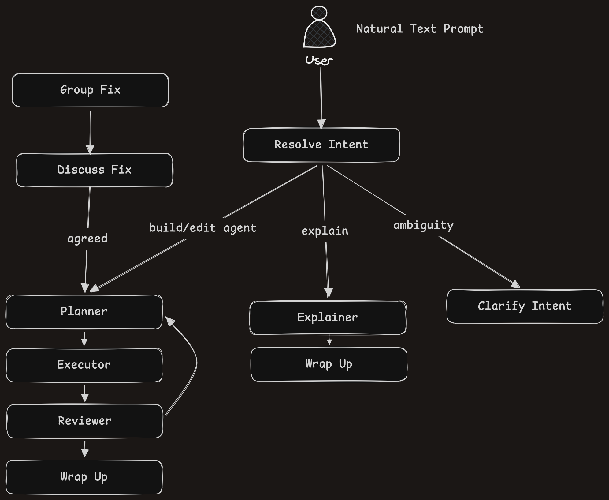

# Solution

Github Repository: https://github.com/umutalacam/prosper-challenge-agent-copilot

## Overview

Prosper's voice agents handle healthcare scheduling calls. Here an agent is a **graph of nodes** (Pipecat Flows). Each node is one phase of the call, and **actions** are the functions the LLM calls to move between phases, collecting fields as it goes. The agent is stored as plain JSON and compiled into a voice pipeline when a call starts.

On top of that format, the solution has three parts:

1. **Agent Composer**: a canvas editor for building agents, with versioned saves, deploys and test calls from the browser.
2. **Agent Copilot**: an AI assistant docked in the editor. It builds and edits the agent from natural language, and the edits appear live on the canvas.
3. **Call monitoring loop**: every call is recorded and checked for problems. Calls with problems get an AI analysis, and any finding can be sent to the copilot with **Fix with copilot**. This closes the loop: _build → call → find what went wrong → fix → redeploy_.

## Tech Stack

### UI

- **React 19 + TypeScript**, built with Vite
- **React Flow** for the node graph canvas
- **TanStack Query** for fetching and polling server data
- **SCSS modules** for styling
- **Vitest** for tests

### Backend

- **Python + FastAPI**: one process serves the API and the voice bot
- **Pipecat + Pipecat Flows** for the voice pipeline (ElevenLabs speech-to-text and text-to-speech, OpenAI LLM)
- **SQLite** for storage
- **OpenAI** for the copilot and the call analysis
- **pytest** for tests

## Feature Concepts

The product follows the life of an agent: you build it, ship it, watch its calls, and fix what goes wrong. The concepts below are grouped in that order.

### Building an agent

An **agent** is a phone assistant whose conversation is a graph. It has a name, a persona (the system prompt it follows on every call), a model, a voice, and a set of nodes. It is stored as a JSON document that uses Pipecat Flows' own vocabulary (`role_message`, `task_messages`, …). The one addition is `edges`, which describe transitions as plain data rather than Python closures, so that a language model can write them.

A **node** is one phase of the call, such as identifying the caller or offering appointment times. Each node holds a short list of **tasks**, which are the instructions the agent follows while it is in that phase, one instruction each. Every call begins at the start node and finishes at an end node, where the agent says goodbye.

An **action** is how the call moves from one node to the next. The LLM calls it like a function once the conditions in its description are met. Its **fields** are the details the agent must collect from the caller before it can move on, for example a full name and date of birth.

### Saving and shipping

Every save creates a new **version** of the agent, and earlier versions are never overwritten. If two people edit the same agent, the second save is rejected with a conflict instead of silently replacing the first person's work.

Saving an agent doesn't put it in front of callers. A **deployment** pins one saved version as the one that answers calls, and later edits stay invisible to callers until the agent is deployed again. Deployments are kept as a history, so deleting the live agent falls back to whichever agent was deployed before it.

A **test call** deploys the agent open in the editor and opens the voice client in a new tab, so you can talk to it straight away.

### Watching calls

Every finished call is recorded with its full timeline: what the caller and the bot said, each move between nodes along with the details collected, and the state of the conversation after each step. The **Call Log** lists these calls, filtered by how they ended (completed, abandoned, not started, or error). Opening a call shows the path it took through the graph and its transcript.

### From a call to a fix

Every call is analyzed in two stages, and the result of the analysis can be handed straight to the copilot. Together these turn a failed call into a change to the agent:

**1. Deterministic analysis.** When a call ends, the backend checks its timeline against fixed rules, with no model involved. This is fast and cheap, so it runs on every call. It looks for three kinds of anomaly:

- **Stuck**: the bot kept improvising in a node without moving on, and the call ended there unfinished. This is treated as a failure.
- **Long stay**: the bot improvised for a while in a node, but the call eventually moved on. This is kept as a note.
- **Error**: the voice pipeline itself failed.

The issues are stored with the call, so they can be counted across calls and versions.

Not every problem shows up in the call's events, so customers can also **flag** a call with a short reason, such as "it booked the wrong day". A flag is treated as an issue too.

**2. AI analysis.** The rules can say _where_ a call went wrong, but not _why_. So when the deterministic analysis finds an issue, or a customer flags the call, an AI analysis runs in the background to enrich it. Calls without issues are never sent to the model. The model reads the agent as it was at the time of the call, the issues, the path and the transcript. It returns a short summary and one finding per issue, each with the node involved, the **cause** and a **suggested fix**. The caller has already hung up by then, so the analysis delays nobody. The call detail shows "Analyzing this call…" until the result arrives.

**3. Fixing a single call.** Every finding comes with a **Fix with copilot** button. Pressing it sends the finding to the copilot as the goal of a turn. The copilot treats the suggested fix as a hint and makes the smallest change to the current agent that removes the cause. The edits appear live on the canvas, ready to review, save and redeploy.

**4. Finding the common cause.** One stuck call might be bad luck, but seven calls stuck in the same node point to a problem in the agent. The **Issues pane** groups issues across all of an agent's calls by version, kind and node (for example "Stuck in greeting · 7 calls"), and lists customers' flags beside them. A badge counts what is new since the pane was last opened.

Each group has a **Fix** button that starts a **group fix**. The copilot reads the causes the AI analysis found for every call in the group and works out the **common cause** behind them. It then proposes one fix for that cause. You can discuss and adjust the fix with the copilot, and it applies the fix once you agree. This fixes the pattern rather than one call at a time.

## Software Design

### Backend structure

```
backend/
  src/
    main.py              app factory: routers, domain error → HTTP mapping, lifespan
    dependencies.py      providers (@lru_cache singletons), injected with Depends
    config.py            paths, models, DB location
    agent_builder/       schema.py (the JSON contract) + builder.py (validate + compile)
    api/
      agents/            routes → service → repository
      bot/               voice pipeline, deployments, WebRTC signaling, call log
      calls/             recorder, analyzer, AI analyzer, issues, flags
      copilot/           graph, nodes, prompts, edits, model wrapper
  config/                schema.sql, seed.sql, prompts and JSON schemas (not code)
  tests/
```

**One package per feature, three layers each.** `routes.py` handles HTTP only: parsing, headers, status codes. `service.py` holds the rules. `repository.py` holds SQL. Domain errors (`AgentNotFound`, `InvalidAgent`, `VersionConflict`, `NothingDeployed`) are mapped to HTTP codes in one place in `main.py`. Adding a feature means adding `api/<feature>/`, a provider and an `include_router`.

**One validator.** Every save goes through `AgentBuilder.from_dict`, the same code the voice pipeline uses to load an agent, so neither the UI nor the copilot can save an agent the bot can't run. The builder compiles each edge into a `FlowsFunctionSchema` whose handler merges the collected arguments into the flow state, and it builds nodes lazily on transition. It also appends fixed voice rules (short sentences, one question at a time, no lists or markdown) to every node's role message, so no persona can leave them out.

**The voice pipeline stays close to the original.** `bot/pipeline.py` is kept as close as possible to the pipeline in the case codebase: a generic STT → LLM → TTS pipeline with no graph logic. The new features plug into it from outside rather than changing how it runs. The agent comes in as a compiled `AgentBuilder`, call events are passed to `CallLog` through Pipecat's existing event hooks, and the call is saved when it ends. Swapping agents is a data change. `BotService` owns the WebRTC handler and the running calls, and it resolves each call's agent when the call connects: a requested agent for a test call, otherwise the deployed version.

**Call recording and judging are separate.** Each step has a single owner:

- `CallRecorder` tracks a call: the current node, the path, reply counts and the timeline.
- `CallLog` turns the recorder's events into readable `[call <id>]` log lines.
- `CallAnalyzer` judges a stored call with no model involved. It produces the steps (one per stay in a node) and the issues.
- `CallRecordService.save` stores the call and its issues in one transaction, then runs the AI analysis (`pending` → `done` / `failed`).

The call is saved in the pipeline's `finally:` block, after the caller has hung up, so nobody waits on the analysis, and a storage or model failure can't break hang-up. Issues are rows in their own indexed table (`call_issues`), so "where does version 3 get stuck" is a query, not a scan of timelines.

**Dependency injection without a framework.** Each provider in `dependencies.py` is wrapped in `@lru_cache`, which gives one instance per process. Tests replace a provider with `app.dependency_overrides`.

**Database access without a framework.** Storage uses Python's built-in `sqlite3` module with hand-written SQL, without an ORM. Each feature has a small repository class (`AgentRepository`, `CallRepository`, `DeploymentRepository`), and the repository is the only code that touches the database. Repositories return plain dataclasses such as `AgentRecord` and `CallRecord`, so services never see rows or connections. The schema lives in `config/schema.sql` and is applied idempotently on every start. Writes that must not interleave run in `BEGIN IMMEDIATE` transactions. Agent and call bodies are stored as JSON columns, and generated columns expose the fields that listings need. An ORM with migrations (for example SQLAlchemy and Alembic) would be the natural next step as the schema grows. For the scope of this case, I chose plain SQL behind repositories for simplicity, and the repositories keep the rest of the code independent of that choice.

**Prompts are configuration.** Prompts, tool definitions and JSON schemas live in `backend/config/` and are re-read on every use, so prompt changes don't need a restart. A config test checks that every model-calling node has a prompt, that every schema is valid in strict mode, and that `tools.json` matches the edit methods.

### Copilot Design

The copilot is **stateless** on the server. Each turn, the browser sends the working copy of the agent and the conversation. `POST /api/copilot/turns` streams NDJSON events back (`activity`, `note`, `agent`, `reply`, `questions`, `proposal`, `done`, …), and each `agent` event is applied to the canvas as a live, unsaved edit. Because the agent JSON travels with every turn, the copilot always sees the user's hand edits.

**A turn is a walk through a graph of nodes**, not one large prompt:

<p align="center"></p>

Here is what each node does:

- **Resolve intent** works out what the user wants from the turn: a change to the agent (build), an explanation (explain), or more information first (clarify). It writes the goal of the turn in one sentence. When the request is unclear, it asks the user a few questions and ends the turn.
- **Planner** turns the goal into an ordered list of edits.
- **Executor** carries out the plan. It is the only node that can change the agent, which it does through edit tools such as `add_node`, `update_node` and `add_action`.
- **Reviewer** checks the result. If something is still wrong, the turn goes back to the planner, at most three times.
- **Explainer** answers questions about the agent, and **wrap up** writes the closing reply for the turn.
- **Fix** makes no model call. It turns a finding from a call's AI analysis into the goal and hands it to the planner.
- **Group fix** proposes one fix for the common cause across a group of calls. **Discuss fix** keeps that conversation going until the user agrees, then hands the agreed fix to the planner.

**Node contract** (`nodes/base.py`). `run(turn)` does the work, records the result on the shared `Turn` and yields events. `next(turn)` is a pure function that returns the next node's name (`None` ends the turn). Nodes refer to each other only by name and keep no per-turn state. `CopilotGraph` just loops: run, then ask for `next`, with a cap on node runs as a guard against cycles. A node subclasses one of three model styles:

- `DecisionNode` gets one JSON answer under a strict schema. The schema puts a `reason` field first, and the reason is logged. The code, not the model, picks the next node from the answer.
- `ToolNode` runs a tool loop until the model answers without calling a tool.
- `TextNode` gets one plain-text answer.

This is the one place in the codebase that uses real polymorphism, so it gets the abstract base classes.

**Edits are deterministic code.** `AgentEdits` applies each tool call with the same graph rules and cascades as the editor reducer and `AgentBuilder`: renames update targets, deleting a node removes its inbound actions, and nothing may lead into the start node. Each edit either returns a past-tense summary for the UI or raises `EditError`, which goes back to the model as the tool result.

**Validation is layered.** Each check runs as early and as cheaply as possible:

1. `AgentEdits` rejects illegal operations as they happen.
2. `checks.validation_error` runs `AgentBuilder` itself. An invalid agent goes straight back to the planner without a model call.
3. `checks.completeness_gaps` finds dead ends, a missing end node and unreachable nodes. These become hints for the model review.
4. The reviewer model checks the design rules in `shared.md`: a persona in three parts, nodes as phases rather than single questions, branches for each outcome, short separate tasks.

**On the canvas.** While a turn runs, the editor is locked and the reducer refuses every action except `copilotEdit`. Each edit is diffed against the previous one, so new and changed nodes and edges glow, and the viewport glides to them. When the turn ends, the view fits the whole graph. All of this motion respects `prefers-reduced-motion`.

## AI-Assisted Development

I used Claude Code extensively to build this within the given time. I applied a different level of supervision to each side of the codebase.

**Backend: closely supervised.** I directed and reviewed the backend design step by step, because its structure decides how easy the system is to extend. That covers the layering into routes, services and repositories, the single validator in `AgentBuilder`, the separation between recording and judging calls, and the copilot's node graph. Claude Code wrote much of the code, but I made the architectural decisions and checked each change against them.

**Frontend: mostly implemented by Claude Code.** Claude Code did more of the frontend work on its own. I made sure the UI stayed organized:

- Every component lives in its own folder, with its SCSS module next to it.
- Styles use shared tokens and mixins instead of raw values.
- Page-only components stay inside their page, and a component moves to `shared/` only once a second page needs it.

**Consistency made later features faster.** `CLAUDE.md` records the patterns as they were settled, such as how a backend feature is laid out, how a copilot node is added, and how frontend components and styles are organized. Claude Code then followed them in later work. As the project matured, new features became easier to add because each one followed an established pattern. Call flags, the Issues pane and group fixes each fit into the existing structure without reworking what was already there. The test suites on both sides acted as a guardrail for these changes.

## What's next

### Features

**1. Replaying problem calls to verify a fix.** Today a fix goes live with nothing to show it works. Every problem call is already stored with its transcript, its path and the state after each step. An AI caller could replay each one against the fixed draft: it would play the original caller, using their goal and the details they gave, and react to whatever the new version says. The Issues pane would then show the result for each group before deploying, for example "6 of 7 calls that got stuck in greeting now reach booking". A **Fix** would end with a verified change, not just an applied one.

**2. Simulated callers for automatic testing.** For each agent, the copilot would generate a set of test scenarios from its persona and graph:

- callers who want each supported outcome (book, reschedule, cancel)
- unhappy paths (no slot fits, a missing date of birth, a caller who changes their mind)
- callers who go off-topic

Each scenario would run as a simulated call through the real pipeline in text mode, and the results would be recorded like real calls. The deterministic and AI analysis would then run on them unchanged. The scenarios would become a regression suite that runs before every deploy, with an outcome table per version, so problems show up before a real patient hits them.

**3. Insights from high-churn nodes.** `call_issues` already counts where calls get stuck, per node and version. The next step is to look at where callers drop off, meaning the nodes where abandoned calls end and the nodes with the longest stays and most replies. Comparing these across versions would produce insights such as "Since v4, 30% of calls hang up in `offer_times`, after the bot lists more than three slots", each linked to the calls behind it and a proposed group fix. A weekly digest could surface them without anyone opening the Issues pane.

**4. Finding requests the agent doesn't support.** Some long stays and abandoned calls happen because the caller wants something the agent has no path for, such as asking about insurance or requesting a specific doctor. The AI analysis could label these as unsupported requests and cluster them across calls. The copilot could then suggest new features with evidence attached: "14 callers this week asked about insurance coverage. Add an insurance node with a handoff?" Applying a suggestion would start an ordinary copilot build turn. This turns call data into a product roadmap for each agent.

**5. A/B testing across versions.** Today a deployment pins one version, and every call goes to it. With A/B testing, a deployment could split live traffic between two versions, for example 90% to the current version and 10% to a fixed one. Every stored call already records which version handled it, and the Issues pane already counts calls and issues per version. Comparing two versions on real traffic is therefore a natural next step. The comparison would cover:

- completion rate
- stuck and abandoned calls per node
- call length
- customer flags

The editor would show the two versions side by side, with a clear signal once enough calls have come in. The better version could then be promoted to all traffic in one click. Replays and simulations (features 1 and 2) check a fix before it ships, and A/B testing confirms it with real callers without exposing all of them to an untested change.

### Improvements

**1. A better knowledge base for the copilot.** The copilot's design knowledge is currently one prompt file (`shared.md`). It could grow into a curated knowledge base, retrieved by relevance for each turn instead of always being sent in full:

- proven patterns for common phases (identity verification, slot offering, handoff to a human)
- domain rules for healthcare scheduling
- good and bad examples, taken from agents whose calls succeed

Fixes that actually removed an issue could feed back into it. The copilot would then build better agents on the first try, not only after a review loop.

**2. More conservative AI calls.** Today every call with an issue is analyzed by the model as soon as it ends, which costs model calls in proportion to call volume. Instead:

- **On demand**: run the AI analysis only when someone opens the call's detail view, and cache the result. Customer flags would still trigger it right away.
- **Sampled for group fixes**: a group fix would analyze a representative sample of the group's calls, for example the most recent five, rather than every call in it. The common cause is visible in a few calls, and the cost stays flat however large the group grows.

The deterministic analysis stays free and runs on every call, so issue counts and the Issues pane stay complete either way.

**3. Persisting copilot conversations.** Copilot conversations live only in the browser today, so they are lost on reload and nobody can learn from them. Storing every turn on the server, with the prompt, the plan, the edits applied, the reviewer's verdicts and whether the user saved or undid the result, would make them data for improving the copilot:

- **Evaluation sets.** Real requests, and the turns that went wrong, become test cases for comparing prompts and models before changing them.
- **Failure analysis.** Turns where the reviewer looped, the user immediately undid the edits, or the user had to ask again show where the copilot falls short.
- **Feeding the knowledge base.** Turns that led to agents with healthy calls become examples for the knowledge base above.
- **Continuity.** Users could reopen a conversation later on any device, and the copilot could recall why an earlier change was made.

**4. Production readiness.** The rest is the usual hardening:

- authentication, with per-user state for which issues have been seen
- a job queue with retries for the AI analysis, so a restart doesn't drop one in progress
- Postgres instead of SQLite
- the voice bot as its own service, so a code reload doesn't drop live calls
